# CareerPulse AI — AI-Powered Career Guidance Platform

> **"Discover Your Career. Build Your Future."**  
> An intelligent, production-ready, full-stack career guidance and acceleration platform built for college students, fresh graduates, and academic administrators.

---

## 1. Project Overview

**CareerPulse AI** is a comprehensive full-stack career advisory system engineered to eliminate career ambiguity for undergraduate and graduate students. By evaluating technical competencies, soft skills, cognitive aptitude, personality traits, and career interests through a structured 5-step psychometric questionnaire, the platform generates mathematical and AI-driven career recommendations, calculates granular visual skill gaps, provides personalized 3-level learning roadmaps (Beginner to Advanced), audits resumes for ATS compliance, and simulates AI placement mock interviews.

---

## 2. Technology Stack

### Frontend
- **Framework**: React.js (v18.3.1 with Vite fast build tooling)
- **Styling**: Tailwind CSS with custom design tokens, responsive breakpoints, and glassmorphism styling
- **Typography**: Inter (Body) & Outfit (Display headers) via Google Fonts
- **Routing**: React Router DOM (v6.23.1) with protected route wrappers
- **Icons**: Lucide React
- **HTTP Client**: Native Fetch API with centralized Bearer token injection

### Backend
- **Runtime**: Node.js (v18+)
- **Server Framework**: Express.js REST API
- **Authentication**: JSON Web Tokens (JWT) & bcryptjs salted password hashing
- **Security & Middleware**: CORS, Morgan logger, role-based authorization (`STUDENT`, `ADMIN`)

### Database
- **Engine**: MongoDB with Mongoose ODM
- **Collections**: Users, Profiles, Careers, AssessmentQuestions, AssessmentResults, LearningProgress, InterviewSessions, ChatHistory

### Artificial Intelligence
- **Architecture**: Dual-layer AI engine (Large Language Model prompt engineering via Gemini/OpenAI API + deterministic heuristic NLP domain engine for 100% offline & local development reliability)

---

## 3. System Architecture

```mermaid
graph TD
    Client["React.js Frontend (Vite + Tailwind CSS)"] -->|REST API Requests + JWT| Server["Node.js / Express.js Backend"]
    Server -->|Mongoose ODM| DB[(MongoDB)]
    Server -->|Structured Prompt Engine| AIService["AI Career Advisor / Gemini Service"]
    
    subgraph "Student Features"
        Assess["5-Step Career Assessment"]
        Recs["AI Career Matching"]
        Gap["Visual Skill Gap Analysis"]
        Roadmap["Personalized Learning Roadmap"]
        Chat["24/7 AI Career Counselor"]
        Resume["Resume ATS Auditor"]
        Mock["Interactive Mock Interviews"]
        Badges["Milestone Badges & Streaks"]
    end

    subgraph "Admin Features"
        UserMgmt["User Cohort Management"]
        CareerMgmt["Career Tracks & Benchmarks"]
        QuestMgmt["Question Bank Management"]
        Analytics["Platform Telemetry & Reports"]
    end

    Client --> Assess
    Client --> Recs
    Client --> Gap
    Client --> Roadmap
    Client --> Chat
    Client --> Resume
    Client --> Mock
    Client --> Badges
    Client --> UserMgmt
    Client --> CareerMgmt
    Client --> QuestMgmt
    Client --> Analytics
```



---

## 4. Database Schema Design

### Collections Overview:

1. **`users`**:
   - `fullName`, `email`, `password` (hashed with bcrypt), `role` (`STUDENT` | `ADMIN`), `education`, `college`, `graduationYear`, `timestamps`.
2. **`profiles`**:
   - `user` (ref: User), `phone`, `location`, `bio`, `education` (college, degree, department, gradYear, cgpa), `careerInterests` (Array), `technicalSkills` (name, level, proficiency), `softSkills` (Array), `preferredIndustries` (Array), `careerGoal`, `targetCareer` (ref: Career), `resumeData`.
3. **`careers`**:
   - `title`, `slug`, `category`, `description`, `futureScope`, `salaryRange`, `marketDemand`, `requiredSkills` (name, minProficiency, importance), `responsibilities`, `learningRoadmap` (Array of Beginner, Intermediate, Advanced modules with courses & certifications), `certifications`, `interviewTopics`.
4. **`assessmentquestions`**:
   - `step` (1-5), `category` (`interest`, `personality`, `technical`, `aptitude`, `communication`), `question`, `description`, `options` (text, score, affinityDomain).
5. **`assessmentresults`**:
   - `user` (ref: User), `overallScore`, `categoryScores` (interest, personality, technical, aptitude, communication), `domainAffinities`, `recommendations` (careerTitle, matchPercentage, whyRecommended, requiredSkills, currentSkills, missingSkills), `answers`, `completedAt`.
6. **`learningprogresses`**:
   - `user` (ref: User), `career` (ref: Career), `completedModules`, `completedSkills`, `progressPercentage`, `streakDays`, `badgesEarned` (badgeId, title, description, icon, unlockedAt).
7. **`interviewsessions`**:
   - `user` (ref: User), `category`, `status` (`in-progress` | `completed`), `currentIndex`, `questions` (question, hint, studentAnswer, feedback, score, suggestedStructure), `averageScore`.
8. **`chathistories`**:
   - `user` (ref: User), `messages` (sender, text, timestamp).

---

## 5. REST API Documentation

### Authentication (`/api/auth`)
- `POST /api/auth/register` — Register a student account
- `POST /api/auth/login` — Sign in and receive JWT token
- `GET /api/auth/me` — Retrieve current authenticated user profile
- `POST /api/auth/forgot-password` — Password reset trigger
- `POST /api/auth/logout` — Invalidate user session

### Student Profile (`/api/profile`)
- `GET /api/profile` — Fetch student profile with education and skill scores
- `PUT /api/profile` — Update personal info, skills, education, and career goals

### Career Assessment (`/api/assessments`)
- `GET /api/assessments` — Retrieve all 5 steps of assessment questions
- `POST /api/assessments/submit` — Submit answers, calculate dimensional scores, and generate recommendations
- `GET /api/assessments/results` — Fetch student's latest assessment score report

### Careers & Skill Gap (`/api/careers`)
- `GET /api/careers` — List all careers (supports `?category=` and `?search=`)
- `GET /api/careers/:id` — Get detailed career breakdown with roadmap
- `POST /api/careers/recommend` — Calculate personalized career matches
- `GET /api/skill-gap` — Compare student skills against target career requirements

### Learning Roadmaps (`/api/learning-path`)
- `GET /api/learning-path` — Get active career learning roadmap & progress
- `POST /api/learning-path/progress` — Toggle or mark module as complete; awards milestone badges

### AI Services (`/api/ai`)
- `POST /api/ai/career-recommendation` — AI career guidance synthesis
- `POST /api/ai/chat` — Chat with floating AI Career Counselor
- `GET /api/ai/chat/history` — Fetch recent counselor message history
- `DELETE /api/ai/chat/history` — Clear conversation history
- `POST /api/ai/resume-review` — Resume ATS score analysis and bullet enhancement

### Interview Preparation (`/api/interview`)
- `POST /api/interview/start` — Initialize simulated interview session by category
- `POST /api/interview/answer` — Submit answer for real-time AI critique and score
- `GET /api/interview/history` — Retrieve past practice interview scores

### Admin Management (`/api/admin`)
- `GET /api/admin/users` — List and search student accounts
- `PUT /api/admin/users/:id` — Update user roles and basic data
- `DELETE /api/admin/users/:id` — Delete user account and associated data
- `GET /api/admin/analytics` — Platform statistics, career demand, and user growth
- `POST /api/admin/careers` — Create a new career track with required skills
- `DELETE /api/admin/careers/:id` — Delete career track
- `POST /api/admin/assessments` — Add question to assessment bank
- `DELETE /api/admin/assessments/:id` — Delete question

---

## 6. Pre-Seeded Demo Credentials

The platform includes one-click demo login buttons directly on the Login page, as well as preset credentials:

| Role | Email | Password | Access Area |
| :--- | :--- | :--- | :--- |
| **Demo Student** | `student@careerpulse.ai` | `password123` | Complete Student Portal & Dashboard |
| **Platform Admin** | `admin@careerpulse.ai` | `adminpassword123` | Admin Command Center & User Management |

---

## 7. How to Run Locally

### Prerequisites
- Node.js (v18 or higher)
- MongoDB running locally on `mongodb://127.0.0.1:27017`

### Step 1: Clone Repository
```bash
git clone https://github.com/your-username/careerpulse-ai.git
cd careerpulse-ai
```

### Step 2: Install All Dependencies
```bash
npm run install:all
```
*(Or navigate to `/server` and run `npm install`, then `/client` and run `npm install`)*

### Step 3: Seed Database
```bash
npm run seed
```
*(Populates 7 career domains, 10 assessment questions, demo student with roadmaps, and admin account)*

### Step 4: Run Development Servers
```bash
npm run dev
```
- **Backend API**: `http://localhost:5000`
- **Frontend App**: `http://localhost:5173`

---

## 8. Deployment Guide

### Deploy Backend (Render / Railway)
1. Push repository to GitHub.
2. Create a new Web Service on **Render** or **Railway**.
3. Set Root Directory to `server`.
4. Set Build Command to `npm install` and Start Command to `node src/server.js`.
5. Set Environment Variables:
   - `PORT=5000`
   - `NODE_ENV=production`
   - `MONGO_URI=<your-mongodb-atlas-connection-string>`
   - `JWT_SECRET=<your-random-jwt-secret>`
   - `AI_API_KEY=<optional-gemini-or-openai-key>`

### Deploy Frontend (Vercel)
1. Create a new project on **Vercel**.
2. Set Root Directory to `client`.
3. Framework Preset: **Vite**.
4. Set Build Command to `npm run build` and Output Directory to `dist`.
5. Set Environment Variable:
   - `VITE_API_URL=https://your-backend-service.onrender.com`

---

## 9. License & Internship Compliance

This project is developed in fulfillment of full-stack AI software internship requirements. Distributed under the **MIT License**.
